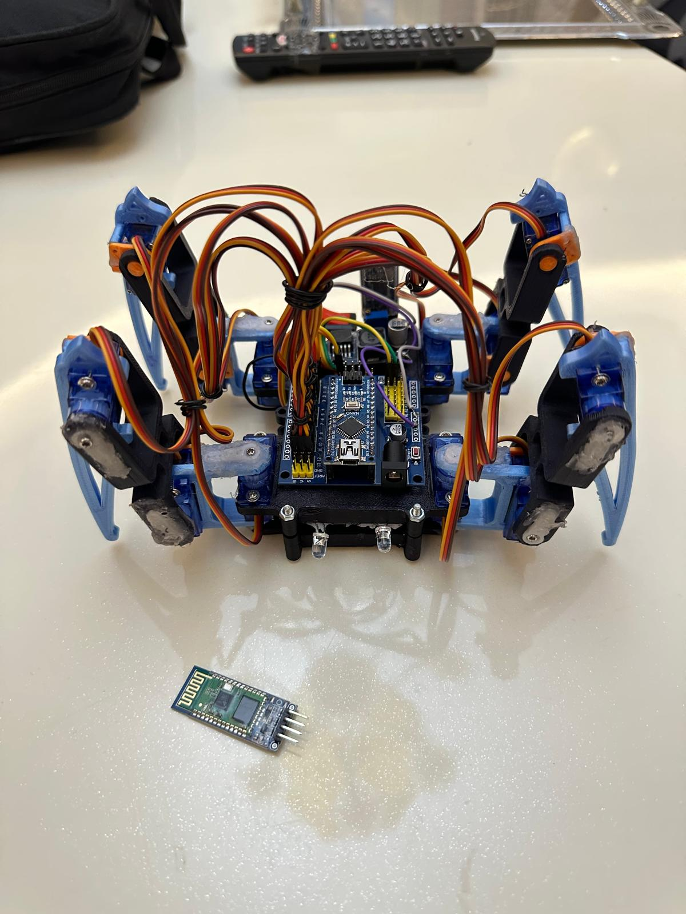

# 🕷️ ÖRümcek - Arduino Kontrollü Spider Robot Projesi

Bu proje, Arduino tabanlı bir örümcek robotunun geliştirilmesini kapsamaktadır. Robot, Bluetooth üzerinden kontrol edilmekte ve çeşitli hareket fonksiyonlarını yerine getirmektedir.

## 🚀 Proje Özellikleri
- Arduino ile geliştirilmiş robot kontrol sistemi
- Bluetooth bağlantısı üzerinden uzaktan kontrol
- Repetitif hareket algoritmaları
- Geliştirilen Android APK uygulaması
- SSD1306 OLED ekran kullanımı (isteğe bağlı)
- Regülatör
- 12 servo motor
- Anahtar
- 2 adet Led(isteğe bağlı)
  

## 🛠️ Kullanılan Donanım
- Arduino Uno
- HC-05 Bluetooth Modülü
- 8 x SG90 Servo Motor
- SSD1306 OLED Ekran (Opsiyonel)
- 3D Baskı ile üretilmiş örümcek gövdesi

## 💾 Klasör Yapısı
| Klasör | Açıklama |
|--------|----------|
| `Code/` | Arduino kodları ve gerekli kütüphaneler |
| `Docs/` | Proje raporları ve dökümanlar |
| `Images/` | Robot fotoğrafları ve diyagramlar |
| `APK/` | Android uygulama dosyası (APK) |
| `Kullanim_Iconlari/` | Projede kullanılan ikonlar |

## 🔧 Kurulum
1. Arduino IDE'yi indir ve kur.
2. `Code/` klasöründen istediğin projeyi aç.
3. Gerekli kütüphaneleri Arduino IDE'ye dahil et:
   - Adafruit-GFX-Library
   - Adafruit_SSD1306
   - FlexiTimer2
4. Kodu Arduino'ya yükle.
5. Android APK dosyasını telefonuna kur ve HC-05 cihazına bağlan.

## 📷 Görseller

## 👨‍💻 Geliştirici
**Ad Soyad**: Erdinç Demir  
**İletişim**: eraydemir300@gmail.com

## 📄 Lisans
Bu proje MIT lisansı ile lisanslanmıştır. Daha fazla bilgi için `LICENSE` dosyasına göz atabilirsiniz.
